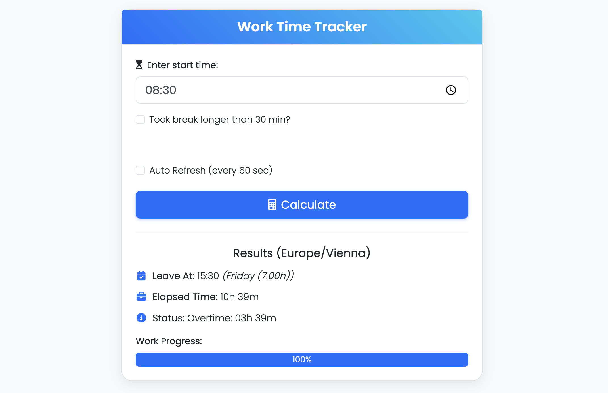

# Work Time Tracker ⏱️

[](https://github.com/bifr0est/worktimeweb/actions/workflows/docker-image.yml)

A simple yet powerful web application built with Flask to calculate your work end time based on your start time, standard work duration (including Fridays), and any extended breaks taken. Features a dynamic interface with AJAX updates, dark mode, and a progress bar.



## ✨ Features

* **Dynamic End Time Calculation:** Calculates when you should leave based on start time and day of the week (configurable work hours for regular days vs. Fridays).
* **Break Adjustment:** Allows inputting total break duration if it exceeds the standard 30 minutes, adjusting the leave time accordingly.
* **Real-time Status:** Shows remaining work time or overtime accrued.
* **AJAX Updates:** Calculates and updates results instantly without full page reloads.
* **Auto-Refresh:** Optional auto-refresh (every 60 seconds) to update status.
* **Timezone Aware:** Uses `pytz` for accurate timezone handling (configurable via environment variable).
* **Work Progress Bar:** Visual indicator of how much of the required work time has been completed.
* **Dark/Light Mode:** User-toggleable theme for comfort.
* **Dockerized:** Ready for deployment via Docker.
* **CI/CD Ready:** Includes GitHub Actions workflow to automatically build and push Docker image to GHCR on commits to `main`.

## 💻 Technologies Used

* **Backend:** Python 3, Flask, Gunicorn, Pytz
* **Frontend:** HTML5, CSS3 (with CSS Variables), JavaScript (Fetch API), Bootstrap 5, Font Awesome, Google Fonts (Poppins)
* **Containerization:** Docker
* **CI/CD:** GitHub Actions

## ⚙️ Setup & Configuration

1.  **Clone the repository:**
    ```bash
    git clone [https://github.com/bifr0est/worktimeweb.git](https://github.com/bifr0est/worktimeweb.git)
    cd worktimeweb
    ```
2.  **Environment Variables:** The application uses environment variables for configuration. You can set these directly in your system or use a `.env` file with `python-dotenv` for local development (add `python-dotenv` to `requirements.txt` if using `.env`).

    * `FLASK_SECRET_KEY`: **Required** for Flask sessions/security. Generate a strong random key.
    * `TIMEZONE`: **Optional** (defaults to `Europe/Vienna`). Olson timezone name (e.g., `America/New_York`).
    * `STANDARD_BREAK_MINUTES`: **Optional** (defaults to `30`).
    * `WORK_HOURS_REGULAR`: **Optional** (defaults to `8`). Base hours Mon-Thu.
    * `WORK_MINUTES_REGULAR`: **Optional** (defaults to `0`). Base minutes Mon-Thu.
    * `WORK_HOURS_FRIDAY`: **Optional** (defaults to `6`). Base hours Fri.
    * `WORK_MINUTES_FRIDAY`: **Optional** (defaults to `30`). Base minutes Fri.
    * `FLASK_DEBUG`: **Optional** (defaults to `0` or `False`). Set to `1` or `True` ONLY for local development.

## 🚀 Running Locally (Development)

1.  **Create & Activate Virtual Environment:**
    ```bash
    python -m venv venv
    source venv/bin/activate  # On Windows use `venv\Scripts\activate`
    ```
2.  **Install Dependencies:**
    ```bash
    pip install -r requirements.txt
    ```
3.  **Set Environment Variables:** (Example for Linux/macOS)
    ```bash
    export FLASK_APP=app:app
    export FLASK_DEBUG=1 # Enable debug mode for development ONLY
    export FLASK_SECRET_KEY='a_very_strong_random_secret_key_local'
    # Optional: export TIMEZONE='Your/Timezone'
    ```
4.  **Run the Flask Development Server:**
    ```bash
    flask run
    ```
5.  Access the app at `http://127.0.0.1:5000`.

## 🐳 Running with Docker

1.  **Build the Docker image:**
    ```bash
    docker build -t worktimeweb .
    ```
    *Alternatively, pull the pre-built image from GHCR:*
    ```bash
    docker pull ghcr.io/bifr0est/worktimeweb:latest
    ```
2.  **Run the Docker container:** (Pass necessary environment variables)
    ```bash
    docker run -d -p 5000:5000 \
      -e FLASK_SECRET_KEY='your_production_secret_key' \
      -e TIMEZONE='Europe/Vienna' \
      --name worktimeweb-container \
      ghcr.io/bifr0est/worktimeweb:latest
      # Or use the locally built image name: worktimeweb
    ```
    *Access the app at `http://localhost:5000` (or your server's IP).*

## 🔄 CI/CD

This repository uses GitHub Actions to automatically build a Docker image and push it to GitHub Container Registry (`ghcr.io`) whenever code is pushed to the `main` branch.

* **Workflow File:** `.github/workflows/docker-image.yml`
* **Image Name:** `ghcr.io/bifr0est/worktimeweb:latest`

You can configure your server (e.g., Unraid Docker) to pull and run this image.

## 📝 To-Do / Future Improvements

* [ ] Client-side input validation (e.g., for break minutes).
* [ ] Add a "Clear Form" button.
* [ ] Implement full Progressive Web App (PWA) features:
    * [ ] Offline caching of app shell.
    * [ ] Offline calculation functionality (requires JS rewrite of logic).
* [ ] Add automated tests (unit/integration).
* [ ] More comprehensive server-side logging.

---

Happy Tracking!